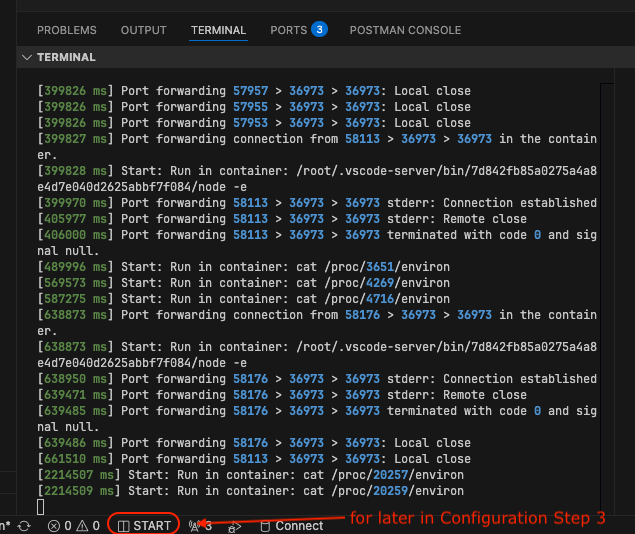

### ⚙️💻 Claude CodePro is a Professional System for Building Quality Code

**🛠️ A structured approach to software development with Specs, Tests, and Professional Workflows.**

**</> Stop vibe coding, start shipping systematically with Spec-Driven Development, TDD, and much more!**

[](https://opensource.org/licenses/MIT)
[](https://claude.ai)


[](http://makeapullrequest.com)

**🌟 Please star this Repository if it helps you ship better Code!**

**🎬 Join the upcoming Masterclass to learn more ➡️ [www.claude-code.pro](https://www.claude-code.pro)**

---

## 📦 What's Inside


### 📋 Token-Optimized Spec-Driven Workflow via Slash Commands
- `/plan` - Based on your input asks the right questions → Detailed spec with exact code (Opus 4.1)
- `/implement` - Execute spec with mandatory TDD → Auto-manages context when full (Sonnet 4.5)
- `/remember` - Stores learnings in cross-session memory → Continue after /clear (Sonnet 4.5)
- `/verify` - E2E spec verification with CodeRabbit AI review → All tests, quality, security (Sonnet 4.5)

### 💡 Auto-Enforce Best Practices and Standards via Skills
- **Testing Skills** - TDD, test writing, anti-patterns, debugging, verification, code review
- **Global Skills** - Coding style, commenting, conventions, error handling, validation
- **Backend Skills** - API design, models, queries, migrations
- **Frontend Skills** - Components, CSS, accessibility, responsive design

### 🔌 Enhanced Context and Capabilities via MCP Servers
- **Cipher & Claude Context** - Cross-session memory and semantic code search for optimal context
- **Context7 & Ref** - Up-to-date library documentation with limited context blur
- **DBHub & FireCrawl** - Database access and web scraping for dynamic data retrieval
- **MCP Funnel** - Allows to plug-in more MCP servers as needed without wasting context

### 🛠️ Testing and Quality via Automated Tool Installation
- **CodeRabbit** - AI-powered code review for quality and security
- **Qlty** - Automated code quality hooks for all programming languages
- **Newman** - API end-to-end testing with Postman collections
- **uv, ruff, mypy, basedpyright** - Python linter, formatter, and type checker

### 🏗️ Automated Dev Container Setup (VS Code / Cursor / Windsurf)
- **Integrated Features** - Zsh, Node.js, Docker-in-Docker, uv, ruff, basedpyright, git, fzf
- **IDE Extensions** - Python, Docker, SQL, testing, formatting, and development tools
- **CLI Tools** - qlty, Claude Code, Statusline, dotenvx, CodeRabbit, Cipher, Newman
- **Local Database** - Local PostgreSQL instance on port 5433 for development and testing

---

## 🚀 Getting Started

### 📋 Prerequisites

- **[Docker Desktop](https://www.docker.com/products/docker-desktop/)** or **[OrbStack](https://orbstack.dev/download)**
- **[VS Code](https://code.visualstudio.com/)** or **[Cursor](https://cursor.com/)** or **[Windsurf](https://windsurf.dev/)**
- **[Dev Containers Extension](https://marketplace.visualstudio.com/items?itemName=ms-vscode-remote.remote-containers)**
- **Optional**: **[Warp](https://www.warp.dev/)** for the best terminal experience

### 📥 Installation

1. Clone this repository: `git clone https://github.com/maxritter/claude-codepro.git`
2. Open in VS Code, click on the button on the bottom-left: `Reopen in Container` or open the command pallette via `Ctrl + Shift + P` and then use `> Dev Containers: Reopen in Container`
3. Wait for automatic build to finish, this can take a couple of minutes (feel free to watch the logs in `vscode`)


4. Copy `.env.example` to `.env` and add your credentials and API keys
```bash
cp .env.example .env
vim .env
```
5. Run `cc` (which is an alias we created) in the Terminal to finish CC Setup, `cr` to finish CodeRabbit setup
```bash
# alias to spawn claude code with loaded environment varaibles
cc
# code rabbit cmd line tool and setup
cr
```

---

## 📒 How-to-use

### ⚙️ Configuration

1. In CC, run `/config` to set auto-connect to IDE to true and set `Auto-compact=false` for best experience


2. In CC, run `/ide` to connect to VS Code diagnostics and make sure all MCP servers for `/mcp` are online


3. In VS Code, click `START` in the lower bar of the IDE to start a split terminal and monitor CC usage with `/usage`. (see screenshot of the *Installation* section)

4. Open Claude Code in the IDE Terminal, Extension or an external Terminal like Warp with the `cc` command

### 👣 First Steps

- Start with `/plan` - Provide your input and it will ask clarifying questions to create a spec
- Use `/implement` to execute the spec with automatic TDD, best practices and context management
- When context fills, `/remember` automatically updates your plan and stores learnings
- After spec completion, run `/verify` to run CodeRabbit AI review, all tests, and quality checks

## ⚖️ What Makes This Different

**Compared to Other Spec-Driven Frameworks (OpenSpec, SpecKit, AgentOS):**

- 💾 **Persistent Memory** - Cross-session memory maintains knowledge between resets
- ⚡ **Token-Optimized** - No tokens wasted during too complex planning, just works
- ✅ **Production-Grade** - Actively used in client and enterprise projects
- 📝 **Enforced TDD** - Code written before tests gets deleted automatically
- 💯 **Real Verification** - Must show actual outputs based on tests, not assumptions
- 🛠️ **Complete Ecosystem** - Skills, MCP servers, testing tools are integrated and configured
- 📦 **Works Immediately** - Pre-configured automated setup with everything you need

---

## 👥 Who This Is For

- **Professional Developers** - Shipping to production with quality standards
- **Solo Builders** - Managing complex features without losing context
- **Engineering Teams** - Ensuring consistent TDD and code quality
- **Frustrated Coders** - Tired of half-tested, "should work" implementations

---

## 🎬 Masterclass Coming Soon!

If you want to dive deeper into the setup and advanced usage of Claude CodePro, check out the upcoming video masterclass with 10 comprehensive modules where we do a deep-dive into all important topics:

### ➡️ [www.claude-code.pro](https://www.claude-code.pro)

---

## 🤝 Contributing

Contributions welcome: custom skills, MCP integrations, workflow improvements, bug reports.

---

## 🙏 Acknowledgments

- **[astral-sh/uv](https://github.com/astral-sh/uv)** - Fast Python package manager
- **[astral-sh/ruff](https://github.com/astral-sh/ruff)** - Fast Python linter and formatter
- **[DetachHead/basedpyright](https://github.com/DetachHead/basedpyright)** - Enhanced Python type checker
- **[python/mypy](https://github.com/python/mypy)** - Static type checker for Python
- **[dotenvx/dotenvx](https://github.com/dotenvx/dotenvx)** - Environment variable management
- **[postmanlabs/newman](https://github.com/postmanlabs/newman)** - End-to-End API testing
- **[pytest-dev/pytest](https://github.com/pytest-dev/pytest)** - Python testing framework
- **[qltysh/qlty](https://github.com/qltysh/qlty)** - Code quality automation
- **[campfirein/cipher](https://github.com/campfirein/cipher)** - CC Cross-session memory
- **[zilliztech/claude-context](https://github.com/zilliztech/claude-context)** - CC Semantic code search
- **[hagan/claudia-statusline](https://github.com/hagan/claudia-statusline)** - CC Status line integration
- **[upstash/context7](https://github.com/upstash/context7)** - MCP Library documentation
- **[ref-tools/ref-tools-mcp](https://github.com/ref-tools/ref-tools-mcp)** - MCP Documentation search
- **[mendableai/firecrawl-mcp](https://github.com/mendableai/firecrawl)** - MCP Web scraping
- **[bytebase/dbhub](https://github.com/bytebase/dbhub)** - MCP PostgreSQL connectivity
- **[chris-schra/mcp-funnel](https://github.com/chris-schra/mcp-funnel)** - MCP Tool filtering

---

Made with ❤️ by [Max Ritter](https://www.maxritter.net)

[🌐 claude-code.pro](https://www.claude-code.pro)
