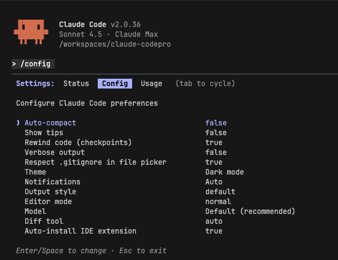
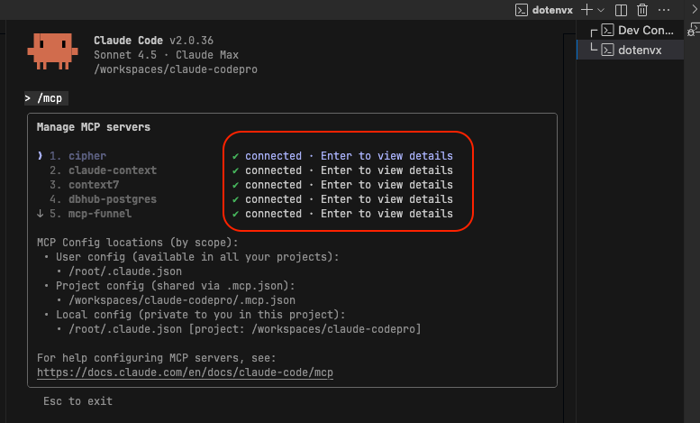

<div align="center">


### A Professional System for Building Quality Code with Claude Code (CC)

Start shipping systematically with Spec-Driven Development, Skills, TDD, Semantic Search, Persistent Memory, Context Management, Quality Hooks, Modular Rules System, and much more 🚀

[](https://opensource.org/licenses/MIT)
[](https://claude.ai)


[](http://makeapullrequest.com)

---

#### 🆕 What's New in v2.1.0

- **One-Line Installation** - Install into any existing project with a single curl command
- **Modular Rules System** - Configurable rules builder system for Slash Commands and Skills
- **`/quick` Command** - Alternative to spec-driven workflow for fast fixes and refactoring

---

#### [⭐ Star this repo](https://github.com/maxritter/claude-codepro) • [🎓 Join the Academy](https://www.claude-code.pro) • [📦 Releases](https://github.com/maxritter/claude-codepro/releases)

</div>

---

## 📦 What's Inside


### 📋 Flexible Development Workflows via Slash Commands

**Quick Development** (For fast fixes, refactoring, experiments):
- `/quick` - Fast, focused development without spec-driven overhead → No mandatory TDD (Sonnet 4.5)

**Spec-Driven Workflow** (For complex features requiring planning and testing):
- `/plan` - Based on your input asks the right questions → Detailed spec with exact code (Opus 4.1)
- `/implement` - Execute spec with mandatory TDD → Auto-manages context when full (Sonnet 4.5)
- `/remember` - Stores learnings in cross-session memory → Continue after /clear (Sonnet 4.5)
- `/verify` - End-to-end spec verification → All tests, quality, security (Sonnet 4.5)

### 💡 Modular Rules System with Auto-Generated Commands & Skills
- **Rules Builder** - Automatically assembles commands and skills from markdown rules on every `cc` startup
- **Core Rules** - Coding standards, TDD enforcement, error handling, validation, context management
- **Extended Rules** - Domain-specific rules auto-converted to skills, f. ex. @frontend-components
- **Workflow Rules** - Command-specific behavior for /plan, /implement, /verify, /quick, /remember
- **Flexible Customization** - Edit `.claude/rules/config.yaml` to adjust which rules apply to which commands

### 🔌 Enhanced Context and Capabilities via MCP Servers
- **Cipher & Claude Context** - Cross-session memory and semantic code search for optimal context
- **Context7 & Ref** - Up-to-date library documentation with limited context blur
- **FireCrawl** - Web scraping and search for dynamic data retrieval in MarkDown format
- **MCP Funnel** - Allows to plug-in more MCP servers as needed without wasting context

### 🛠️ Testing and Quality via Automated Tool Installation
- **Post-Edit Hooks** - Automated formatting and code checking after every edit
- **Qlty** - Automated code quality hooks for all programming languages
- **uv, ruff, mypy, basedpyright** - Python linter, formatter, and type checker (optional)
- **Newman** - API end-to-end testing with Postman collections

### 🏗️ One-Command Installation
- **Automated Setup Script** - Installs and configures everything in one command
- **Global Tools** - Python tools, qlty, Claude Code, Cipher, Newman installed globally
- **Shell Integration** - Auto-configures bash, zsh, and fish with `cc` alias
- **IDE Compatible** - Works with VS Code, Cursor, Windsurf, or any terminal

---

## 🚀 Getting Started

### 📋 Prerequisites

- **Linux/macOS/WSL** - Shell environment required
- **Node.js & npm** - For MCP servers and tooling

### 📥 Installation

Run this one-liner in any existing project directory:

```bash
curl -sSL https://raw.githubusercontent.com/maxritter/claude-codepro/main/scripts/install.sh | bash
```

**Installation steps:**

1. **Optional Python Support** - Choose whether to install advanced Python features
   - Answer `y` to install: uv, ruff, mypy, basedpyright, and Python quality hooks
   - Answer `n` for language-agnostic setup (Node.js, Go, Rust, etc.)

2. **Claude CodePro Files** - Downloads configuration and rules
   - `.claude/` - Commands, skills, hooks, and settings
   - `.cipher/` - Persistent memory configuration
   - `.qlty/` - Code quality configuration
   - `.mcp.json` & `.mcp-funnel.json` - MCP server configuration

3. **API Keys Setup** - Interactive wizard guides you through:
   - Zilliz Cloud (vector DB for memory and semantic search)
   - OpenAI API (for memory LLM calls)
   - Context7 (library documentation)
   - Ref (documentation search)
   - Firecrawl (web scraping)

4. **Dependencies Installation** - Automatically installs:
   - **Core** (always): Claude Code CLI, qlty, Cipher, Newman, dotenvx, Statusline
   - **Python** (optional): uv, ruff, mypy, basedpyright

5. **Shell Configuration** - Adds `cc` alias to bash, zsh, and fish

6. **Build Commands & Skills** - Generates all slash commands and skills from rules

**After installation:**

1. Reload your shell: `source ~/.bashrc` (or `~/.zshrc`)
2. Run: `cc`
3. Configure with `/config`:
   - Set 'Auto-connect to IDE' = true
   - Set 'Auto-compact' = false
4. Verify setup:
   - `/ide` - Connect to VS Code
   - `/mcp` - Check MCP servers are online

---

## 📒 How-to-use

### ⚙️ Configuration

1. Open Claude Code in the IDE Terminal, Extension or an external Terminal with the `cc` command

2. In CC, run `/config` to set `Auto-connect to IDE=true` and set `Auto-compact=false` for best experience


3. In CC, run `/ide` to connect to VS Code diagnostics and make sure all MCP servers for `/mcp` are online


4. In CC, run `/context` to verify context looks similar to this screenshot with less than 20% used


### 👣 First Steps

**For Quick Changes:**
- Use `/quick` - Fast development for fixes, refactoring, or experiments without spec overhead
- TDD not enforced, but best practices still apply via core rules and auto-injected skills

**For Complex Features (Spec-Driven & TDD):**
- Start with `/plan` - Provide your input and it will ask clarifying questions to create a spec
- Use `/implement` to execute the spec with automatic TDD, best practices and context management
- When context fills, `/remember` automatically updates your plan and stores learnings
- After spec completion, run `/verify` to run end-to-end review, all tests, and quality checks

### 🎯 Rules Builder
The system uses a modular rules-based architecture that automatically generates slash commands and skills:

- `.claude/rules/core/` - Fundamental rules injected into all commands
- `.claude/rules/workflow/` - Command-specific behavior (plan.md, implement.md, verify.md, quick.md, remember.md)
- `.claude/rules/extended/` - Domain-specific rules auto-converted to individual skills
- `.claude/rules/config.yaml` - Defines which rules are included in which commands

**Auto-Rebuild:** Commands and skills are automatically regenerated on every `cc` startup, making customization seamless.

## ⚖️ What Makes This Different

**Compared to Other Spec-Driven Frameworks (SpecKit, AgentOS, OpenSpec):**

- 📦 **One-Line Installation** - No containers, no complex setup, just one curl command
- 🤓 **Language Agnostic** - Works with Python, Node.js, Go, Rust, or any language
- 💾 **Persistent Memory** - Cross-session memory maintains knowledge between resets
- ⚡ **Token-Optimized** - No tokens wasted during too complex planning, just works
- ✅ **Production-Grade** - Actively used in client and enterprise projects
- 📝 **Enforced TDD** - Code written before tests gets deleted automatically
- 💯 **Real Verification** - Must show actual outputs based on tests, not assumptions
- 🛠️ **Complete Ecosystem** - Skills, MCP servers, testing tools are integrated and configured

---

## 👥 Who This Is For

- **Professional Developers** - Shipping to production with quality standards
- **Solo Builders** - Managing complex features without losing context
- **Engineering Teams** - Ensuring consistent TDD and code quality
- **Frustrated Coders** - Tired of half-tested, "should work" implementations

---

## 🎓 Claude CodePro Academy Coming Soon!

If you want to dive deeper into the setup and advanced usage of Claude CodePro, check out the upcoming  academy that starts with 10 comprehensive modules where we do a deep-dive into all important topics:

➡️ **[www.claude-code.pro](https://www.claude-code.pro)**

---

## 🤝 Contributing

Contributions welcome: custom skills, MCP integrations, workflow improvements, bug reports, etc.

---

## 🙏 Acknowledgments

- **[dotenvx/dotenvx](https://github.com/dotenvx/dotenvx)** - Automatic .env loading for Claude Code
- **[qltysh/qlty](https://github.com/qltysh/qlty)** - Code quality automation
- **[obra/superpowers](https://github.com/obra/superpowers)** - CC Skills inspiration
- **[buildermethods/agent-os](https://github.com/buildermethods/agent-os)** - CC Spec-Driven inspiration
- **[campfirein/cipher](https://github.com/campfirein/cipher)** - CC Cross-session memory
- **[zilliztech/claude-context](https://github.com/zilliztech/claude-context)** - CC Semantic code search
- **[hagan/claudia-statusline](https://github.com/hagan/claudia-statusline)** - CC Status line integration
- **[upstash/context7](https://github.com/upstash/context7)** - MCP Library documentation
- **[ref-tools/ref-tools-mcp](https://github.com/ref-tools/ref-tools-mcp)** - MCP Documentation search
- **[mendableai/firecrawl-mcp](https://github.com/mendableai/firecrawl)** - MCP Web scraping
- **[chris-schra/mcp-funnel](https://github.com/chris-schra/mcp-funnel)** - MCP Tool filtering
- **[postmanlabs/newman](https://github.com/postmanlabs/newman)** - End-to-End API testing
- **[astral-sh/uv](https://github.com/astral-sh/uv)** - Fast Python package manager
- **[astral-sh/ruff](https://github.com/astral-sh/ruff)** - Fast Python linter and formatter
- **[DetachHead/basedpyright](https://github.com/DetachHead/basedpyright)** - Enhanced Python type checker
- **[python/mypy](https://github.com/python/mypy)** - Static type checker for Python

---

Made with ❤️ by [Max Ritter](https://www.maxritter.net) and [Manuel Vogel](https://www.manuel-vogel.de)

[🌐 claude-code.pro](https://www.claude-code.pro)
